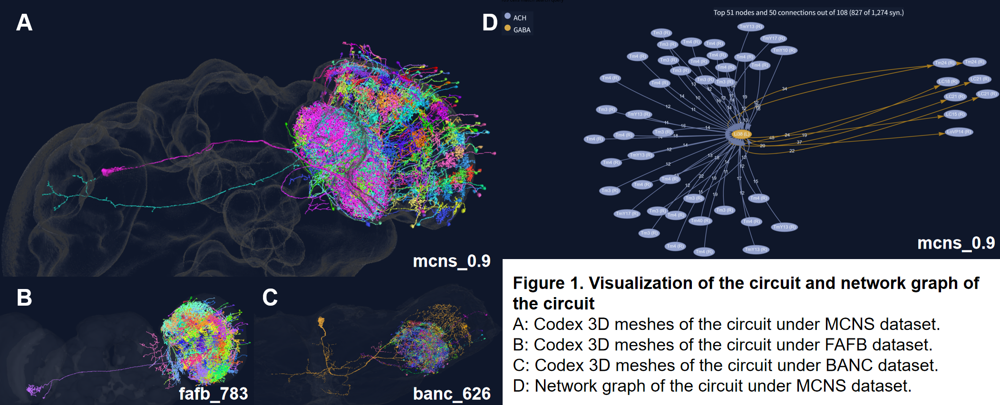

#### Putative Function of a Li38-Centered Visual Circuit
This study focuses on a conserved circuit of 109 neurons identified across the MCNS v0.9, BANC 626, and FAFB 783 datasets, with functional analyses based on annotations from MCNS v0.9.

##### Observations
{width=75%}

This circuit is located at the right side of the brain (Fig 1A-C), dominated by optic-lobe intrinsic neurons (101/109 neurons) and is largely cholinergic (104/109 neurons). The most abundant neuron types are Tm3 (41 neurons) and Tm4 (32 neurons), with additional contributions from TmY13, TmY17, LC11, LC18, LC21, and a central lobula intrinsic neuron, Li38.

The strongest upstream inputs include L1/L2, Mi1, Tm3, Tm4, and T2a neurons. These cell types are associated with ON- and OFF-pathway visual processing. Network topology suggests that Li38 acts as a hub connecting many of the identified neurons (Fig 1D).

##### Interpretation and Biological Hypothesis

The circuit's composition points to a role in higher-order visual feature processing in the lobula. Abundant ON- and OFF-pathway neurons may enable integration of contrast and edge information, while TmY neurons could link multiple visual processing streams. The presence of object-related lobula output neurons (LC11, LC18, LC21) suggests this circuit contributes to detecting or representing small visual objects. Overall, I hypothesize that this Li38-centered network participates in object-feature extraction or small-target processing.

>References:  
>[1] Shinomiya K, et al. (2019). Comparisons between the ON- and OFF-edge motion pathways in the Drosophila brain. *eLife*, 8, e40025.  
>[2] Wu M, et al. (2016). Visual projection neurons in the Drosophila lobula link feature detection to distinct behavioral programs. *eLife*, 5, e21022.  
>[3] Keleş MF, et al. (2017). Object-Detecting Neurons in Drosophila. *Curr Biol*, 27(5), 680–687.